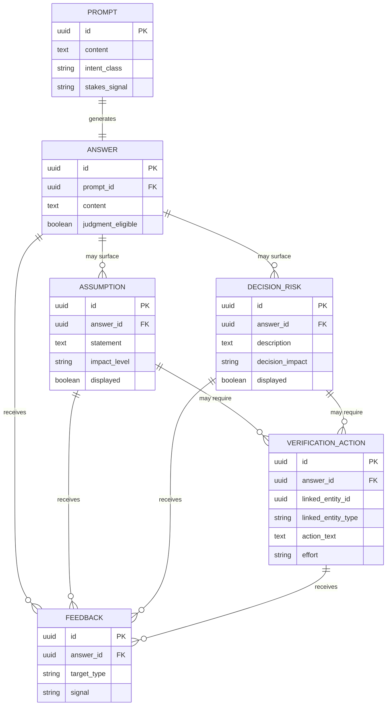
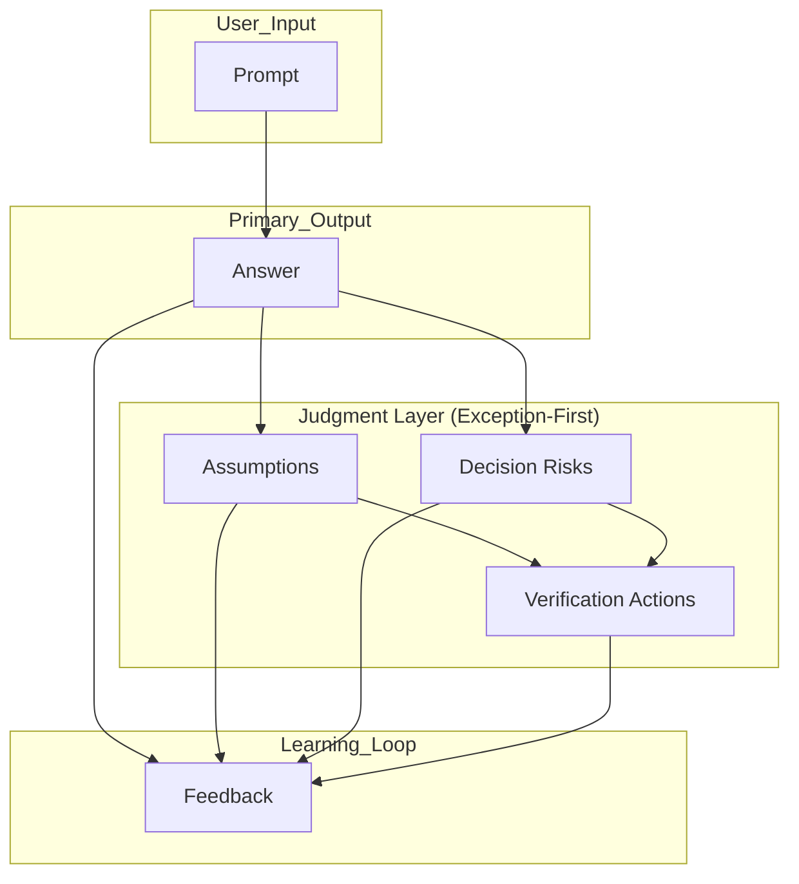
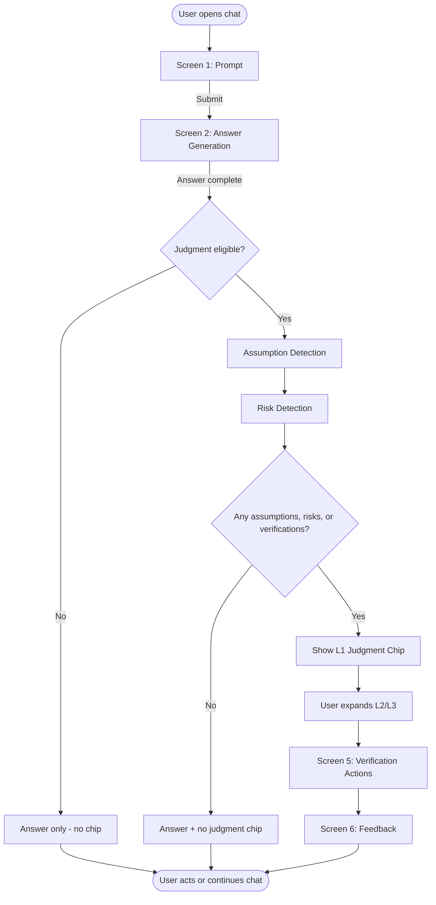
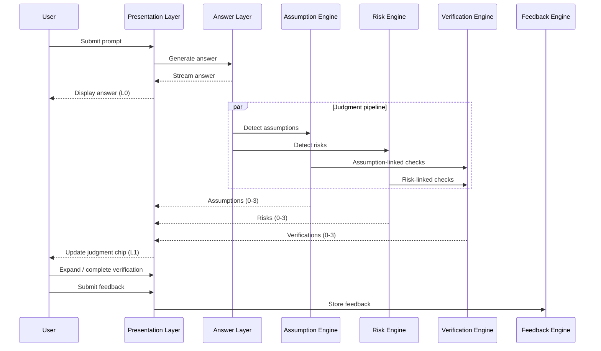
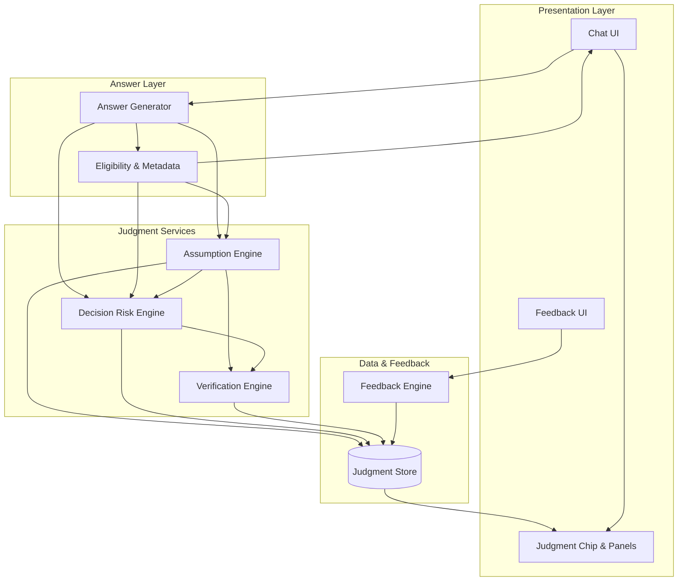
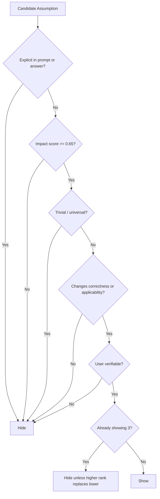
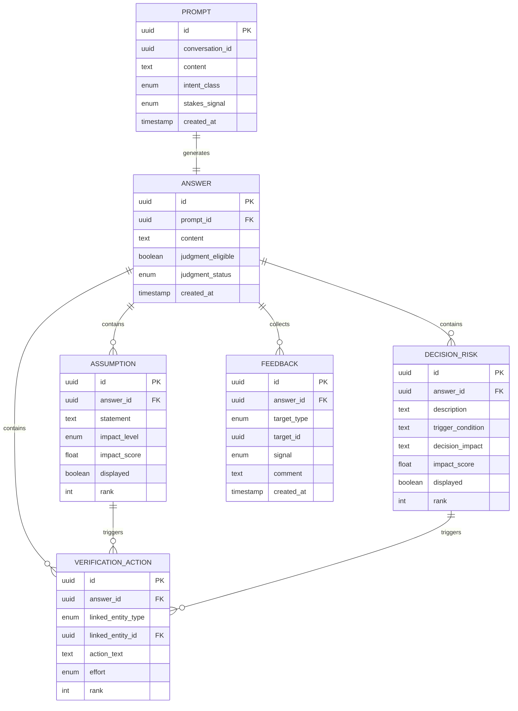

# Trust Through Judgment
## Product Architecture Document

| Field | Value |
|-------|-------|
| **Feature** | Trust Through Judgment |
| **Product** | ChatGPT |
| **Version** | MVP Architecture v1.0 |
| **Status** | Draft for Review |
| **Audience** | Product, UX, Engineering, Leadership |

---

## Table of Contents

1. [Executive Summary](#1-executive-summary)
2. [Product Vision](#2-product-vision)
3. [Problem Statement](#3-problem-statement)
4. [User Personas](#4-user-personas)
5. [Jobs To Be Done](#5-jobs-to-be-done)
6. [Product Principles](#6-product-principles)
7. [Information Architecture](#7-information-architecture)
8. [End-to-End User Flow](#8-end-to-end-user-flow)
9. [UX Architecture](#9-ux-architecture)
10. [System Architecture](#10-system-architecture)
11. [Decision Logic](#11-decision-logic)
12. [Data Model](#12-data-model)
13. [MVP Functional Requirements](#13-mvp-functional-requirements)
14. [Non-Functional Requirements](#14-non-functional-requirements)
15. [Success Metrics](#15-success-metrics)
16. [Risks & Mitigations](#16-risks--mitigations)
17. [Future Roadmap](#17-future-roadmap)
18. [Competitive Advantage](#18-competitive-advantage)
19. [One-Page Product Summary](#19-one-page-product-summary)

---

## 1. Executive Summary

**Trust Through Judgment** is a ChatGPT capability that helps users evaluate AI outputs for research, planning, and professional decisions—without trust scores, confidence scores, citation counts, or generic warnings.

The product follows an **answer-first, exception-first** model: users receive a complete response immediately; judgment aids appear only when they would change a decision. The system surfaces **meaningful assumptions** (what the answer depends on), **decision-changing risks** (what could make the answer wrong before acting), and **actionable verification** (concrete steps to validate before use).

MVP scope is intentionally narrow: prompt → answer → assumption detection → risk detection → verification actions → feedback. Personalization, memory, source ranking, team features, and regulatory tooling are explicitly out of scope.

**Strategic outcome:** Users develop better judgment over time while cognitive load stays minimal. Success is measured by verification follow-through and decision quality—not by perceived model confidence.

**Core differentiator:** Transparency about *dependencies* and *stakes*, not about *model certainty*.

---

## 2. Product Vision

### Vision Statement

Help users evaluate AI outputs instead of blindly trusting or rejecting them—by making the invisible structure of an answer visible only when it matters.

### What We Are Building

A judgment layer that sits alongside the answer and answers three user questions:

1. **What is this answer assuming?** (only assumptions that materially affect correctness or applicability)
2. **What could make this wrong before I act?** (only risks that would change a real decision)
3. **What should I verify?** (specific, doable checks—not “double-check with a professional”)

### What We Are Not Building

| Excluded | Rationale |
|----------|-----------|
| Trust / confidence scores | Scores substitute for judgment; users anchor on numbers without understanding why |
| Citation counts | Volume ≠ quality; encourages citation theater |
| Generic warnings | “AI can make mistakes” adds noise without decision value |
| Personalization (MVP) | Judgment primitives must work universally before tailoring |
| Memory (MVP) | Avoids hidden profile bias in trust surfacing |

### Experience North Star

> *“I got my answer fast. I know exactly what to double-check before I use it—and only when it actually matters.”*

---

## 3. Problem Statement

### Context

Users increasingly use AI for research, planning, decision-making, and professional deliverables. Outputs feel authoritative; mechanisms to evaluate them feel shallow.

### Current Trust Mechanisms Fail Because

| Mechanism | User belief | Reality |
|-----------|---------------|---------|
| Confidence scores | “87% = probably right” | Opaque calibration; no link to *what* could fail |
| Citations | “Many links = verified” | Citations may be irrelevant, outdated, or misapplied |
| Generic warnings | “I was warned” | No guidance on *what* to verify or *when* it matters |

### The Judgment Gap

Users cannot easily determine:

- **Assumption dependency** — Which unstated premises does this answer require to be true?
- **Failure modes** — Under what conditions does this answer break?
- **Verification priority** — What checks matter *before acting* vs. nice-to-have?

### Opportunity

Replace trust *signals* with trust *literacy*: structured, exception-first disclosure that teaches users how to evaluate outputs without increasing cognitive load.

### Success Definition (Problem Level)

Users act on AI outputs with explicit awareness of dependencies and pre-action verification—without requiring them to read parallel essays of disclaimers.

---

## 4. User Personas

### Persona 1: Product Manager

| Dimension | Detail |
|-----------|--------|
| **Goals** | Ship decisions backed by market/competitive reasoning; align stakeholders; move roadmaps forward quickly |
| **Pain Points** | AI synthesizes plausible strategy without grounding; hard to separate narrative from evidence; stakeholders ask “how do we know?” |
| **Trust Challenges** | Over-trusts crisp frameworks; under-detects outdated market assumptions; needs to know what to validate before exec reviews |

**JTBD hook:** *When I'm preparing a strategy recommendation, I want to see what the answer assumes about our market so I don't present fiction as analysis.*

---

### Persona 2: Researcher

| Dimension | Detail |
|-----------|--------|
| **Goals** | Find accurate, current information; trace claims; avoid contamination in literature reviews |
| **Pain Points** | Citations look complete but miss key studies; conflates correlation and causation; dates and scopes blur |
| **Trust Challenges** | Needs assumption clarity (population, timeframe, geography); needs risk surfacing when evidence is thin or contested |

**JTBD hook:** *When I'm building an evidence base, I want to know which claims depend on weak or assumed premises before I cite them.*

---

### Persona 3: Business Analyst

| Dimension | Detail |
|-----------|--------|
| **Goals** | Produce requirements, models, and recommendations with defensible logic; reduce rework from wrong baselines |
| **Pain Points** | AI fills gaps with plausible numbers; edge cases hidden; verification feels ad hoc |
| **Trust Challenges** | Must spot when answers assume stable inputs (rates, regulations, volumes); needs verification tied to data sources and owners |

**JTBD hook:** *When I'm drafting a business case, I want decision-changing risks surfaced so finance doesn't catch them first.*

---

### Persona 4: Knowledge Worker

| Dimension | Detail |
|-----------|--------|
| **Goals** | Complete everyday work faster (email, summaries, planning, how-tos) with acceptable quality |
| **Pain Points** | No time for deep verification; warning banners ignored; unsure what “good enough” means |
| **Trust Challenges** | Needs minimal, high-signal guidance; verification must be actionable in &lt;2 minutes; risks only when stakes are high |

**JTBD hook:** *When I'm using AI for something that could embarrass me or cost money, I want a short checklist—not a lecture.*

---

## 5. Jobs To Be Done

| Job | Situation | Motivation | Expected Outcome |
|-----|-----------|------------|------------------|
| **Evaluate before acting** | Received an answer I might use in a meeting, doc, or decision | Avoid costly mistakes | I know what to verify and what I can skip |
| **Understand dependencies** | Answer sounds right but I don't know what it's built on | Reduce hidden premise risk | I see only assumptions that would change my use of the answer |
| **Prioritize verification** | Limited time; many possible checks | Focus effort | I get 1–3 concrete verification actions, not a generic list |
| **Learn judgment patterns** | Repeated use over weeks | Build mental models | I start anticipating what to check without reading everything |
| **Give useful signal** | Judgment layer helped or didn't | Improve product | My feedback improves detection quality without exposing PII |

### Primary Job (MVP)

> **When** I receive an AI answer I might act on, **I want** to see only the assumptions and risks that would change my decision, **so I can** verify the right things quickly and use the answer with informed confidence.

### Secondary Jobs (Post-MVP)

- Calibrate judgment to my domain and stakes (V3)
- Detect intent and stakes automatically (V2)
- Validate against domain-specific sources (V4)

---

## 6. Product Principles

| # | Principle | Definition | Design Implication |
|---|-----------|------------|-------------------|
| P1 | **Answer first** | Complete response is primary; judgment is adjunct | Answer renders fully before judgment UI expands |
| P2 | **Exception-first** | Show judgment only when it changes user behavior | Default collapsed; empty states are success |
| P3 | **Meaningful assumptions only** | Assumption = premise that affects correctness/applicability | Filter trivial or universally true premises |
| P4 | **Decision-changing risks only** | Risk = condition that would change action if true | No “AI may err” boilerplate |
| P5 | **Actionable verification** | Each action = specific check a user can complete | Verb-led, bounded, no vague “consult expert” |
| P6 | **Progressive disclosure** | Layers: answer → summary chip → detail panels | Never dump all judgment at once |
| P7 | **Minimal cognitive load** | Cap visible items; plain language; scannable | Max 3 assumptions, 3 risks, 3 verifications in MVP |
| P8 | **No trust scores** | No numeric trust/confidence | Qualitative labels only if needed (“verify before use”) |
| P9 | **No citation counts** | Citations may exist in answer; not a trust metric | Do not badge “12 sources” |
| P10 | **No generic warnings** | Warnings must be specific to this answer | Block templated disclaimer strings |

### Principle Conflicts & Resolution

| Conflict | Resolution |
|----------|------------|
| Thoroughness vs. minimal load | **Exception-first wins** — hide low-impact items |
| Transparency vs. speed | **Answer first** — judgment async if needed, never block answer |
| Safety vs. noise | **Decision-changing risks only** — escalate stakes, not volume |

---

## 7. Information Architecture

### Object Definitions

| Object | Definition | Key Attributes |
|--------|------------|----------------|
| **Prompt** | User input that triggers generation | `text`, `intent_class`, `stakes_signal`, `timestamp` |
| **Answer** | Model-generated primary response | `content`, `generation_id`, `has_judgment_layer` |
| **Assumption** | Unstated premise the answer depends on | `statement`, `impact`, `evidence_basis`, `show_reason` |
| **Decision Risk** | Condition that could make the answer wrong *before acting* | `description`, `trigger_condition`, `severity`, `decision_impact` |
| **Verification Action** | Concrete user-checkable step | `action_text`, `method`, `effort`, `linked_assumption_or_risk_id` |
| **Feedback** | User signal on judgment usefulness | `target_type`, `rating`, `optional_comment` |

### Relationship Model



### Information Hierarchy (User Mental Model)

```
Conversation
└── Turn
    ├── Prompt (user)
    └── Answer (assistant) ← primary
        └── Judgment Layer (optional, collapsed by default)
            ├── Assumptions (0–3)
            ├── Decision Risks (0–3)
            └── Verification Actions (0–3)
        └── Feedback (per item or layer)
```

### Navigation & Disclosure Rules

| Level | Content | Default State |
|-------|---------|---------------|
| L0 | Answer body | Visible |
| L1 | Judgment summary chip (“2 assumptions · 1 risk · Verify”) | Visible only if count &gt; 0 |
| L2 | Assumptions / Risks / Verification tabs or sections | Collapsed |
| L3 | Item detail (why shown, linked verification) | On expand |

### IA Diagram (Conceptual)



---

## 8. End-to-End User Flow

### Flow Overview

| Step | User Goal | System Behavior | UI State | Success Criteria |
|------|-----------|-----------------|----------|------------------|
| **1. User Prompt** | Ask question clearly | Capture prompt; classify intent & stakes (lightweight) | Standard composer; optional stakes hint if high-risk pattern detected | Prompt submitted; classification stored |
| **2. Answer Generation** | Get complete answer fast | Stream/generate answer; parallel judgment eligibility check | Answer streams in; judgment chip hidden until ready | Full answer visible; TTFB within SLA |
| **3. Assumption Detection** | Know hidden dependencies | Extract candidate assumptions; score impact; filter to meaningful | Chip updates: “N assumptions” or hidden if N=0 | ≤3 assumptions; each passes impact threshold |
| **4. Risk Detection** | Know what could change decision | Detect failure modes tied to action; filter generic risks | Chip adds risk count; risks in L2 panel | ≤3 risks; each passes decision-impact threshold |
| **5. Verification Actions** | Know what to do next | Map assumptions/risks to concrete checks; dedupe | Verification list with effort tags | ≤3 actions; each completable in &lt;15 min (MVP target) |
| **6. Feedback** | Improve system; close loop | Capture thumbs/helpful per item or layer | Inline feedback on expand | Feedback stored with target attribution |

### Detailed Step Specifications

#### Step 1: User Prompt

- **User goal:** Express task with enough context for a useful answer.
- **System behavior:** Persist prompt; run lightweight `intent_class` (informational / planning / decision / creative) and `stakes_signal` (low / medium / high) from lexical + pattern rules (MVP: no personalization).
- **UI state:** Composer active; no judgment UI.
- **Success criteria:** Prompt ID created; stakes ≥ low assigned.

#### Step 2: Answer Generation

- **User goal:** Read answer immediately; not wait for judgment.
- **System behavior:** Generate answer via standard pipeline; set `judgment_eligible` flag; enqueue judgment jobs without blocking stream completion.
- **UI state:** Streaming answer; skeleton or absent judgment chip.
- **Success criteria:** Answer complete; judgment pipeline completes within p95 budget or degrades gracefully (answer-only).

#### Step 3: Assumption Detection

- **User goal:** See what the answer assumes—only if it matters.
- **System behavior:** Assumption Engine extracts premises → scores materiality → applies show/hide rules (Section 11).
- **UI state:** L1 chip appears if ≥1 assumption displayed; L2 collapsed list.
- **Success criteria:** Zero false “empty” failures when meaningful assumptions exist; no display when all filtered out.

#### Step 4: Decision Risk Detection

- **User goal:** Understand what could make answer wrong *before acting*.
- **System behavior:** Risk Engine maps failure modes to user decision → filters non-decision-changing risks.
- **UI state:** Chip shows combined counts; risks tab/section.
- **Success criteria:** High-stakes prompts show ≥1 risk when material risk exists; low-stakes informational prompts often show 0.

#### Step 5: Verification Actions

- **User goal:** Complete targeted checks quickly.
- **System behavior:** Verification Engine generates 1–3 actions linked to assumptions/risks; orders by decision impact then effort.
- **UI state:** Checklist UI; optional “mark done” local state (session only, MVP).
- **Success criteria:** User can execute action without interpreting jargon; each action links to parent assumption or risk.

#### Step 6: Feedback

- **User goal:** Signal helpful/unhelpful without friction.
- **System behavior:** Store feedback with `target_type` + `target_id`; aggregate for model tuning queues (no personalization in MVP).
- **UI state:** Per-item and optional layer-level feedback after expand.
- **Success criteria:** Feedback submitted in ≤2 taps; no mandatory comment.

### User Flow Diagram



### Sequence Diagram (System View)



---

## 9. UX Architecture

### Global UX Patterns

- **Answer-first layout:** Judgment never pushes answer below fold on load.
- **Single judgment chip:** One entry point; internal tabs for Assumptions / Risks / Verify.
- **Plain language:** No “confidence,” “trust score,” or “hallucination probability.”
- **Scannable blocks:** Title + one-line rationale + optional “why shown.”

---

### Screen 1 – Prompt

| Attribute | Specification |
|-----------|---------------|
| **Purpose** | Capture user intent with minimal friction; optionally surface stakes awareness without blocking send |
| **Components** | Message composer, send control, optional context attachments (existing ChatGPT), subtle stakes indicator (only if high-risk pattern detected post-typing, MVP optional) |
| **Interactions** | Type → send; shift+enter newline; attach files per existing patterns |
| **States** | Empty, composing, submitting, error (network), blocked (policy) |
| **Edge cases** | Empty send disabled; extremely long prompt → truncate with warning; multi-turn: judgment applies per answer turn, not whole thread in MVP |

---

### Screen 2 – Answer

| Attribute | Specification |
|-----------|---------------|
| **Purpose** | Deliver full answer as primary artifact; introduce judgment entry only when warranted |
| **Components** | Answer body (markdown), streaming indicator, judgment summary chip (conditional), copy/regenerate (existing) |
| **Interactions** | Read/stream; tap chip → expand judgment panel; regenerate clears judgment for new generation |
| **States** | Streaming, complete (no judgment), complete (with judgment chip), judgment loading, judgment failed (silent degrade) |
| **Edge cases** | Judgment timeout → answer-only, no error toast; regenerated answer → new judgment IDs; short/non-actionable answers → likely no chip |

**Wireframe (ASCII)**

```
┌─────────────────────────────────────────┐
│ [Assistant Answer - full content]       │
│                                         │
│ ┌─────────────────────────────────────┐ │
│ │ ◆ 2 assumptions · 1 risk · Verify  │ │  ← L1 chip (conditional)
│ └─────────────────────────────────────┘ │
└─────────────────────────────────────────┘
```

---

### Screen 3 – Assumptions

| Attribute | Specification |
|-----------|---------------|
| **Purpose** | Show only premises that materially affect correctness or applicability |
| **Components** | Assumption list (max 3), impact label (e.g., “Changes recommendation”), “Why shown” expander, link to related verification |
| **Interactions** | Expand panel from chip → Assumptions tab; tap assumption → detail; navigate to linked verification |
| **States** | Hidden (0 items), collapsed summary, expanded list, item detail |
| **Edge cases** | Duplicate assumptions merged; assumption obvious from prompt → hidden; user disagrees → feedback thumbs down |

**Assumption card template**

```
Assumption: [One plain-language sentence]
Impact: [High / Medium] — [one line on what changes if false]
[Why shown ▾]  [Go to verification →]
```

---

### Screen 4 – Decision Risks

| Attribute | Specification |
|-----------|---------------|
| **Purpose** | Surface conditions that would change user action if they occurred |
| **Components** | Risk list (max 3), trigger condition, decision impact statement, link to verification |
| **Interactions** | Tab switch from Assumptions; expand risk detail; feedback per risk |
| **States** | Hidden, listed, detail expanded |
| **Edge cases** | Risk duplicates assumption → merge into single surface with dual tagging; speculative risks below threshold hidden; time-sensitive risks include date context |

**Risk card template**

```
Risk: [What could go wrong]
If true: [How your decision should change]
[Verify →]
```

---

### Screen 5 – Verification Actions

| Attribute | Specification |
|-----------|---------------|
| **Purpose** | Provide concrete, completable checks before acting on the answer |
| **Components** | Ordered checklist (max 3), effort tag (Quick / Moderate), parent link (assumption or risk), optional local “done” toggle |
| **Interactions** | Mark done (session); open external guidance if action includes search query template; copy check text |
| **States** | Empty (hidden section), active checklist, all marked done |
| **Edge cases** | Verification requires paid source → say so plainly; impossible verification (no public data) → do not generate; action too vague → blocked by QA rules in Verification Engine |

**Verification card template**

```
☐ [Verb-led action]
   Effort: Quick (~2 min) · Linked to: [Assumption/Risk name]
```

---

### Screen 6 – Feedback

| Attribute | Specification |
|-----------|---------------|
| **Purpose** | Capture high-signal user judgment on usefulness without survey fatigue |
| **Components** | Thumbs up/down per assumption, risk, verification, and optional whole layer; optional “What was missing?” (1 line, post-MVP could expand) |
| **Interactions** | Tap thumb → immediate submit; undo within 5s |
| **States** | Idle, submitted, dismissed |
| **Edge cases** | Feedback on hidden item not shown; abusive comment filtered; feedback without expand allowed on chip long-press (optional MVP cut) |

---

### Responsive & Accessibility Notes (UX)

- Chip and panel keyboard-navigable; ARIA labels: “Judgment details, 2 assumptions, 1 risk”
- Color not sole indicator of severity; text labels required
- Screen reader order: Answer → chip → panel tabs → items

---

## 10. System Architecture

### Layer Responsibilities

| Layer | Responsibility | Inputs | Outputs |
|-------|----------------|--------|---------|
| **Presentation Layer** | Render answer, judgment chip, panels, feedback UI; manage disclosure state | Answer + judgment DTOs | User events, feedback events |
| **Answer Layer** | Standard ChatGPT generation; emit `judgment_eligible` and metadata | Prompt | Answer stream, generation_id |
| **Assumption Engine** | Extract, score, filter, rank assumptions | Answer, prompt metadata | 0–3 Assumption entities |
| **Decision Risk Engine** | Detect failure modes; score decision impact; filter generic risks | Answer, prompt metadata, assumptions (optional) | 0–3 Decision Risk entities |
| **Verification Engine** | Generate actionable checks; link to parents; dedupe | Assumptions, risks, answer | 0–3 Verification Action entities |
| **Feedback Engine** | Ingest, validate, store feedback; export for eval pipelines | Feedback events | Acknowledgment, aggregates |

### Architecture Diagram



### Processing Model (MVP)

| Mode | Description |
|------|-------------|
| **Async judgment** | Answer streams first; judgment pipeline runs post-complete (or partial-complete with checkpoint) |
| **Fail-open on answer** | Judgment failure never blocks or replaces answer |
| **Fail-closed on display** | If detection uncertain, prefer hide over false positive |
| **Single turn scope** | Judgment computed per answer artifact, not thread-global |

### API Contracts (Logical)

```
POST /turns/{turnId}/judgment
  → { assumptions[], risks[], verifications[], display_summary }

POST /feedback
  → { target_type, target_id, signal }
```

### Cross-Cutting Concerns

- **Feature flag:** `trust_through_judgment_enabled`
- **Kill switch:** Hide all judgment UI globally
- **Logging:** Structured logs with generation_id; no prompt PII in judgment metrics

---

## 11. Decision Logic

### Design Philosophy

**Default = hide.** Show only when expected value of user attention exceeds cost.

### Global Eligibility Gate

| Condition | Judgment Layer |
|-----------|----------------|
| Answer &lt; 50 tokens | **OFF** |
| Pure creative writing (poem, story) | **OFF** |
| User prompt = chit-chat / greetings | **OFF** |
| Policy-blocked or incomplete answer | **OFF** |
| Informational + low stakes | **Assumptions/Risks mostly OFF** |
| Planning / decision + medium/high stakes | **ON** (subject to filters) |

---

### Assumptions: Show / Hide

#### Show WHEN (all must pass)

1. Premise is **not explicitly stated** in prompt or answer
2. If false, answer **correctness or applicability** changes materially
3. Impact score ≥ **0.65** (normalized, MVP threshold)
4. Not **universally true** in context (e.g., “companies want profit”)
5. User could **reasonably verify** the premise

#### Hide WHEN (any triggers hide)

1. Stated explicitly in answer or prompt
2. Impact score &lt; 0.65
3. Trivial / common-knowledge per domain-agnostic blocklist
4. Duplicate of another shown assumption (merge)
5. Purely stylistic preference, not factual premise

#### Assumption Decision Tree



---

### Risks: Show / Hide

#### Show WHEN

1. Risk is **specific** to this answer (not template)
2. If realized, user would **change action, timing, or scope**
3. Decision-impact score ≥ **0.70**
4. Linked to a **concrete failure mode** (data wrong, law changed, market shifted, etc.)

#### Hide WHEN

1. Generic AI disclaimer semantics
2. Decision-impact &lt; 0.70
3. Hypothetical with negligible probability and no action change
4. Duplicates assumption-only insight (merge to assumption)
5. User stakes = low AND intent = informational

#### Risk Decision Tree

```mermaid
flowchart TD
    R[Candidate Risk] --> R1{Generic disclaimer?}
    R1 -->|Yes| RH[Hide]
    R1 -->|No| R2{Decision impact >= 0.70?}
    R2 -->|No| RH
    R2 -->|Yes| R3{Specific to this answer?}
    R3 -->|No| RH
    R3 -->|Yes| R4{Would user change action?}
    R4 -->|No| RH
    R4 -->|Yes| R5{Low stakes + informational?}
    R5 -->|Yes| RH
    R5 -->|No| R6{Count < 3?}
    R6 -->|No| Rank and trim
    R6 -->|Yes| RS[Show]
```

---

### Verification Actions: Appear / Suppress

#### Appear WHEN

1. Parent assumption or risk is **shown**
2. Action is **specific** (who/what/where/when at least one)
3. Completable by target user persona without undefined “expert”
4. Passes vagueness linter (no “research more”, “be careful”)

#### Suppress WHEN

1. Parent hidden
2. Duplicate of another action (keep higher impact)
3. Cannot be completed with reasonable effort (&gt;30 min MVP cap)
4. Verification would merely repeat reading the answer

---

### Master Logic Table

| Prompt Intent | Stakes | Assumptions | Risks | Verifications |
|---------------|--------|-------------|-------|---------------|
| Informational | Low | Hide | Hide | Hide |
| Informational | High | Show if impact high | Show if decision impact | Show if parents shown |
| Planning | Medium+ | Show | Show | Show |
| Decision | High | Show | Show | Show |
| Creative | Any | Hide | Hide | Hide |

### Display Summary Logic

```
IF assumptions_shown + risks_shown + verifications_shown == 0:
  HIDE judgment chip entirely
ELSE:
  SHOW chip: "{n} assumptions · {m} risks · Verify" (omit zero segments)
```

---

## 12. Data Model

### Entity Specifications

#### Prompt

| Field | Type | Description |
|-------|------|-------------|
| `id` | UUID | Primary key |
| `conversation_id` | UUID | Parent conversation |
| `content` | text | User message |
| `intent_class` | enum | informational, planning, decision, creative, chitchat |
| `stakes_signal` | enum | low, medium, high |
| `created_at` | timestamp | |

#### Answer

| Field | Type | Description |
|-------|------|-------------|
| `id` | UUID | Primary key |
| `prompt_id` | UUID | FK |
| `content` | text | Generated answer |
| `judgment_eligible` | boolean | Passed global gate |
| `judgment_status` | enum | pending, complete, failed, skipped |
| `created_at` | timestamp | |

#### Assumption

| Field | Type | Description |
|-------|------|-------------|
| `id` | UUID | Primary key |
| `answer_id` | UUID | FK |
| `statement` | text | Plain-language premise |
| `impact_level` | enum | medium, high |
| `impact_score` | float | 0–1 |
| `displayed` | boolean | Passed show rules |
| `rank` | int | 1–3 |

#### Decision Risk

| Field | Type | Description |
|-------|------|-------------|
| `id` | UUID | Primary key |
| `answer_id` | UUID | FK |
| `description` | text | What could go wrong |
| `trigger_condition` | text | When it applies |
| `decision_impact` | text | How action changes |
| `impact_score` | float | 0–1 |
| `displayed` | boolean | |
| `rank` | int | 1–3 |

#### Verification Action

| Field | Type | Description |
|-------|------|-------------|
| `id` | UUID | Primary key |
| `answer_id` | UUID | FK |
| `linked_entity_type` | enum | assumption, risk |
| `linked_entity_id` | UUID | FK |
| `action_text` | text | Verb-led instruction |
| `effort` | enum | quick, moderate |
| `rank` | int | 1–3 |

#### Feedback

| Field | Type | Description |
|-------|------|-------------|
| `id` | UUID | Primary key |
| `answer_id` | UUID | FK |
| `target_type` | enum | layer, assumption, risk, verification |
| `target_id` | UUID | nullable for layer |
| `signal` | enum | positive, negative |
| `comment` | text | optional |
| `created_at` | timestamp | |

### ER Diagram (Mermaid)



---

## 13. MVP Functional Requirements

### Must Have

| ID | Requirement |
|----|-------------|
| M1 | Stream/display full answer before judgment UI |
| M2 | Detect and display 0–3 meaningful assumptions per answer |
| M3 | Detect and display 0–3 decision-changing risks per answer |
| M4 | Generate 0–3 actionable verification actions linked to parents |
| M5 | Hide judgment chip when all counts are zero |
| M6 | Progressive disclosure: chip → panel → item detail |
| M7 | Thumbs feedback on assumptions, risks, verifications |
| M8 | No trust scores, confidence scores, or citation counts in judgment UI |
| M9 | Fail-open: answer always delivered if judgment pipeline fails |
| M10 | Per-answer judgment scope (single turn) |

### Should Have

| ID | Requirement |
|----|-------------|
| S1 | Lightweight intent + stakes classification on prompt |
| S2 | “Why shown” explainer on each assumption and risk |
| S3 | Local session “mark verification done” |
| S4 | Merge duplicate assumption/risk surfaces |
| S5 | Judgment refresh on answer regenerate |

### Could Have

| ID | Requirement |
|----|-------------|
| C1 | Copy verification action text |
| C2 | Pre-filled search query for external verification |
| C3 | Layer-level single thumbs feedback |
| C4 | Admin/debug view of filtered-out candidates |

### Won't Have (MVP)

| ID | Exclusion |
|----|-----------|
| W1 | Personalization / user trust profiles |
| W2 | Memory across sessions |
| W3 | Trust or confidence scores |
| W4 | Source ranking systems |
| W5 | Team collaboration / shared verification |
| W6 | Advanced analytics dashboards |
| W7 | Regulatory monitoring modules |
| W8 | Generic warning banners |

---

## 14. Non-Functional Requirements

### Performance

| Metric | Target (MVP) |
|--------|----------------|
| Answer TTFB | No regression vs. baseline ChatGPT |
| Judgment layer p95 latency | ≤ 3s after answer complete |
| Judgment layer p99 latency | ≤ 8s; degrade to hidden chip |
| UI interaction | Panel expand &lt; 100ms (client-side) |

### Usability

| Metric | Target |
|--------|--------|
| Time to understand chip | ≤ 5 seconds (user testing) |
| Max visible judgment items | 9 total (3+3+3) |
| Reading level | Grade 8–10 plain language |

### Scalability

| Dimension | Requirement |
|-----------|-------------|
| Traffic | Stateless judgment workers; horizontal scale |
| Storage | Judgment artifacts retained 30 days MVP (configurable) |
| Cost | Judgment pipeline capped via eligibility gating |

### Accessibility

| Standard | Requirement |
|----------|-------------|
| WCAG | 2.1 AA for judgment chip and panels |
| Keyboard | Full navigation and feedback |
| Screen readers | Announce counts and tab names |

### Reliability

| Metric | Target |
|--------|--------|
| Judgment pipeline availability | 99.5% |
| Error visibility | None user-facing for judgment failures |
| Data durability | Feedback persisted with at-least-once delivery |

---

## 15. Success Metrics

### North Star Metric

**Verified Action Rate (VAR):** % of judgment-eligible answers where the user expands judgment AND marks ≥1 verification done OR submits positive feedback on a verification item within the session.

*Rationale:* Measures whether judgment layer drives real evaluation behavior, not mere opens.

### Leading Indicators

| Metric | Definition | Target Direction |
|--------|------------|------------------|
| Chip engagement rate | % eligible answers with chip expand | ↑ (moderate; not max) |
| Assumption usefulness | Positive feedback / assumption impressions | ↑ |
| Risk usefulness | Positive feedback / risk impressions | ↑ |
| Verification completion | Marked done / shown verifications | ↑ |
| Time-to-first-expand | Seconds from answer complete to expand | ↓ (but not so fast it’s noise) |

### Guardrail Metrics

| Metric | Definition | Threshold |
|--------|------------|-----------|
| Warning fatigue proxy | Negative feedback on layer | &lt; 15% of expands |
| Answer satisfaction regression | CSAT / thumbs on answer | No statistically significant drop |
| Regenerate rate spike | Regenerates after judgment show | Monitor; investigate if +10% |
| Hide rate | Users collapse without reading | Monitor |

### Product Health Metrics

| Metric | Purpose |
|--------|---------|
| False positive rate (eval set) | Shown items marked not helpful |
| False negative rate (eval set) | Hidden items that should have shown |
| Empty chip rate | % eligible with zero surfaced items (should be high for low-stakes) |
| Pipeline failure rate | Reliability |
| p95 judgment latency | Performance |

---

## 16. Risks & Mitigations

| Risk | Description | Impact | Mitigation |
|------|-------------|--------|------------|
| **Warning fatigue** | Users ignore judgment layer like disclaimers | Low engagement | Exception-first; hide chip when zero; no generic warnings |
| **Cognitive overload** | Too many assumptions/risks | Abandonment | Hard cap 3 each; progressive disclosure; plain language |
| **False positives** | Shown assumption/risk not actually material | Trust erosion | Conservative thresholds; “why shown”; feedback loop; eval sets |
| **False negatives** | Missed material risk | Harmful decisions | Stakes-aware gates; red-team eval; monitor FN rate |
| **User confusion** | Unclear difference between assumption and risk | Wrong verification | UX copy patterns; merge duplicates; tab definitions |
| **Trust inflation** | Users assume “verified” because layer exists | Over-confidence | No checkmarks implying truth; copy: “before you act, check…” |
| **Latency perception** | Judgment delays feel like broken UI | Poor UX | Answer first; async chip update; silent degrade |
| **Feedback sparsity** | Insufficient signal to improve | Stagnant quality | Low-friction thumbs; optional comment |

---

## 17. Future Roadmap

### V1 – MVP (This Document)

- Answer-first judgment layer
- Assumption, risk, verification detection
- Exception-first display rules
- Feedback loop

### V2 – Intent Detection

- Improved stakes inference from prompt + thread context
- Dynamic caps (still max-oriented, not score-oriented)
- Better creative vs. decision routing

### V3 – Personalized Trust Memory

- User-specific verification preferences (not trust scores)
- Remember dismissed patterns; tune verbosity
- Opt-in only; transparent controls

### V4 – Domain-Specific Validation

- Finance, legal, medical, engineering playbooks
- Domain verification templates and source class hints
- Partner data validations where licensed

### V5 – Decision Intelligence Platform

- Team workflows: shared verification on decisions
- Decision logs and audit trails
- Integration with enterprise knowledge bases
- Analytics for organizational judgment quality

---

## 18. Competitive Advantage

### Comparison Matrix

| Capability | ChatGPT Citations | Perplexity | Gemini | Copilot | **Trust Through Judgment** |
|------------|-------------------|------------|--------|---------|---------------------------|
| Primary trust signal | Links in answer | Source list + search | Grounding + sources | Enterprise sources | **Assumptions + decision risks** |
| Answers “what could be wrong?” | Implicit | Partial (source disagreement) | Partial | Partial | **Explicit, filtered risks** |
| Actionable next steps | User infers | Open sources | Open sources | Suggested docs | **Linked verification checklist** |
| Cognitive load | Medium–high (many links) | High (source browsing) | Medium | Medium | **Low (exception-first)** |
| Teaches judgment | Low | Low | Low | Low | **High** |

### Differentiation Pillars

1. **Assumption transparency** — Surfaces *dependencies*, not *references*. Users learn what the answer stands on.
2. **Decision risks** — Frames failure in terms of *action change*, not model uncertainty scores.
3. **Actionable verification** — Closes the loop from insight to behavior; optimized for ≤15-minute checks.

### Why Not Scores or Citation Counts

Competitors optimize for **provenance** (where information came from). This feature optimizes for **judgment** (whether to act—and what to check first). Provenance matters; it is not sufficient when premises are unstated or risks are decision-specific.

---

## 19. One-Page Product Summary

### Trust Through Judgment

**One-liner:** Answer first. Show only what would change your decision. Tell users exactly what to verify.

**Problem:** Users can’t tell what AI answers assume, what could make them wrong, or what to check before acting. Scores, citations, and generic warnings don’t fix this.

**Solution:** An exception-first judgment layer on ChatGPT answers:
- **Assumptions** (0–3) — hidden premises that matter
- **Decision risks** (0–3) — what could change your action
- **Verification actions** (0–3) — concrete checks before you act

**Principles:** No trust scores. No confidence scores. No citation counts. No generic warnings.

**MVP scope:** Prompt → Answer → Detection → Verification → Feedback. No personalization, memory, or enterprise analytics.

**Who it’s for:** PMs, researchers, analysts, and knowledge workers who use AI for work that matters.

**How it works:** User gets full answer immediately. If judgment adds value, a single chip appears (e.g., “2 assumptions · 1 risk · Verify”). User expands only if needed.

**Success:** Users complete verification actions and report judgment items useful—without hurting overall answer satisfaction.

**Why us:** Competitors prove where text came from; we help users decide whether to *act* on it.

**Roadmap:** V1 MVP → V2 Intent → V3 Memory → V4 Domain validation → V5 Decision intelligence platform.

**Ask:** Approve MVP for controlled rollout with eval harness for false positive/negative rates and VAR as north star.

---

## Appendix A: Glossary

| Term | Definition |
|------|------------|
| **Meaningful assumption** | Unstated premise that changes answer correctness or applicability if false |
| **Decision-changing risk** | Specific condition that would alter user action if realized |
| **Verification action** | Concrete, bounded check linked to an assumption or risk |
| **Exception-first** | Default hide; show only high-value exceptions |
| **Judgment layer** | Collective UI + services for assumptions, risks, verifications |

## Appendix B: Open Questions (Post-Review)

1. Should high-stakes prompts show a pre-send nudge, or only post-answer judgment?
2. Should verification “done” persist across sessions in V1.1?
3. Internationalization: are impact/risk thresholds culturally invariant?
4. Enterprise: separate admin policies for judgment visibility?

---

*End of document*
